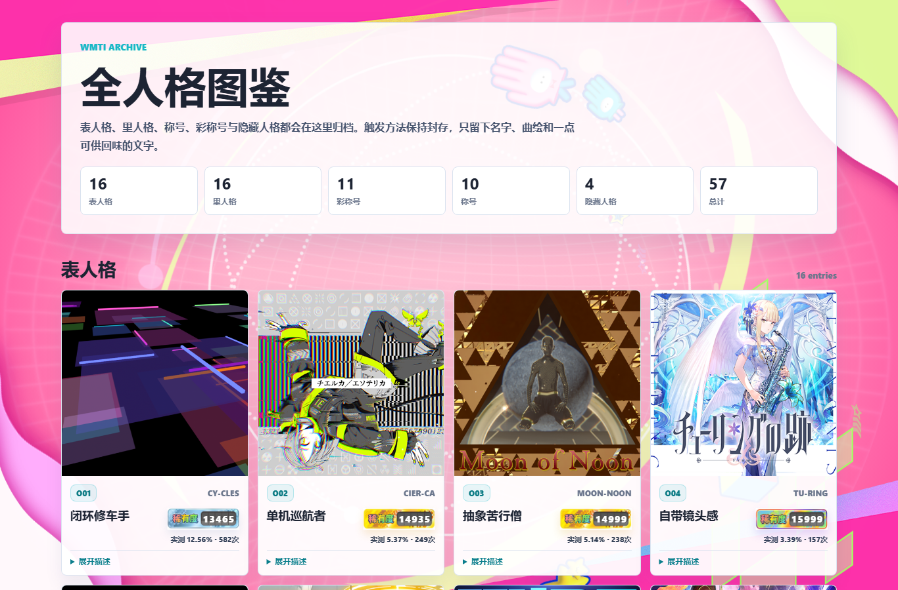
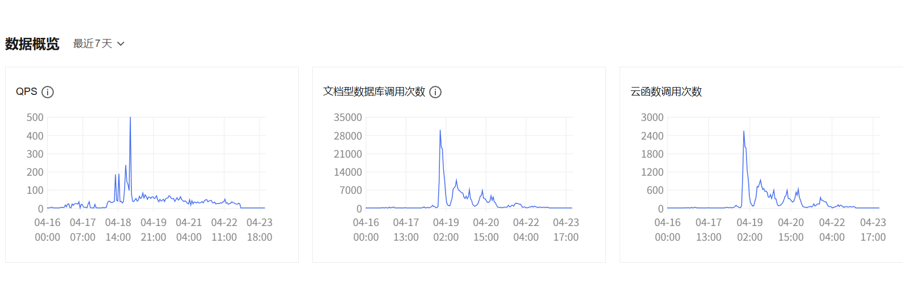
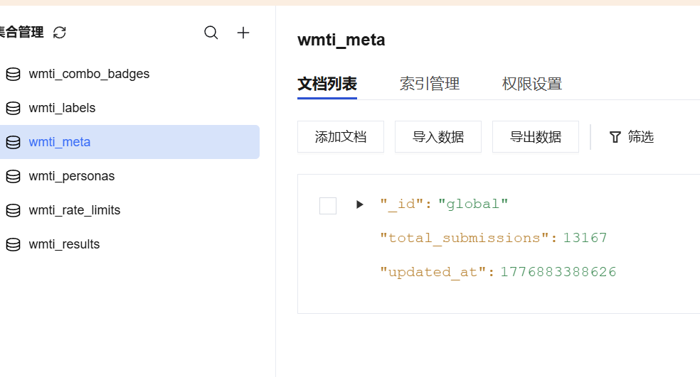
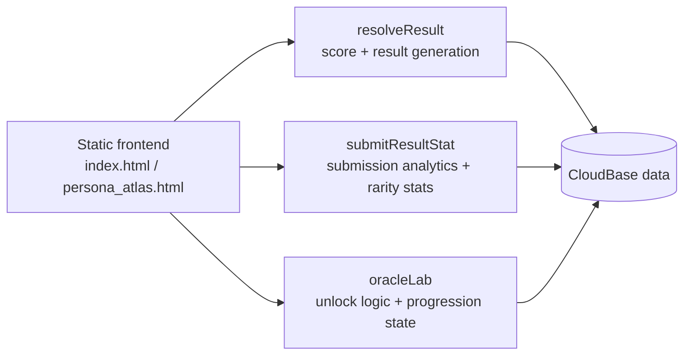

# Interactive Personality Analysis Web App

Public portfolio snapshot of a Tencent CloudBase web app I built for a large-scale interactive analysis experience with share-driven result pages.

## Product and deployment snapshots


Archive / result surface from the deployed frontend.


CloudBase usage overview during active production periods.


Production metadata showing cumulative submission count.

## Frontend and CloudBase flow



## What I personally implemented

- Designed and shipped the frontend quiz flow, result surfaces, archive view, and share-oriented product interactions
- Built the configuration-driven scoring and result engine backed by `maimai_profile_test_config_v2.json`
- Implemented CloudBase functions for result resolution, submission tracking, rarity analytics, and rate limiting
- Added the archive / oracle progression layer and the supporting function-side state model
- Drove the production deployment flow on Tencent CloudBase and iterated on real-user product polish

## Highlights

- Reached 13,000+ cumulative completions in production deployment
- Configuration-driven scoring and result generation
- Cloud-backed submission tracking, rarity analytics, and rate limiting
- Rich user-facing result flows, rarity layers, and secondary atlas views

## Repository Scope

This repository is a cleaned public version prepared for portfolio review.

- Keeps the core frontend experience, assets, and CloudBase function code
- Removes deployment artifacts, local backups, generated snapshots, and `node_modules`
- Replaces production CloudBase identifiers and publishable keys with placeholders

## Project Structure

- `index.html`: main quiz and result experience
- `persona_atlas.html`: follow-up atlas / rarity view
- `maimai_profile_test_config_v2.json`: configuration-driven quiz and result content
- `assets/`: production visual assets and embedded motion assets
- `vendor/`: browser-ready CloudBase and QR code libraries
- `cloudfunctions/`: backend logic for result resolution, submission tracking, and oracle flows
- `docs/screenshots/`: screenshots for quick review

## Local Preview

Because this is a static frontend plus CloudBase functions, you can preview the UI locally with any static file server.

Example:

```bash
python -m http.server 8080
```

Then open `http://localhost:8080`.

The public repo ships with placeholder CloudBase config in `public-app-config.js`, so cloud-backed submission and result APIs will stay disabled until valid project settings are supplied.

## Cloud Configuration

Frontend runtime settings live in `public-app-config.js`.

Expected fields:

- `cloudbaseEnvId`
- `cloudbaseRegion`
- `cloudbasePublishableKey`
- `defaultShareQrTargetUrl`

For backend deployment, the CloudBase functions also expect runtime secrets such as `WMTI_ORACLE_SECRET` to be configured in the target environment rather than committed into the repo.
